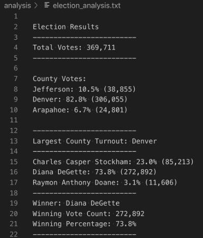
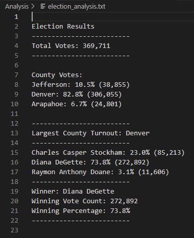

# Election Analysis Challenge
Demonstration of Python election analysis for BootCamp DataViz. 

# Overview
Analysis of election results using Python to read in a csv file and provide the following deliverables: 
1. The election results printed to the command line
2. The election results saved to a text file
3. A written analysis of the election audit

The original analysis requested by the Colorado Board of Elections requested an audit of a recent local election for the following data: 
- Total number of votes cast
- A complete list of candidates who received votes
- Total number of votes each candidate received
- Percentage of votes each candidate won
- The winner of the election based on the popular vote

The election commission has requested some additional data to complete the audit:
- The voter turnout for each county
- The percentage of votes from each county out of the total count
- The county with the highest turnout

The results are expected to be provided to the terminal and in a text file using the following template: 

## Resources Used
- Data source: election_results.csv
- Software: Python 3.7.6, Visual Studio Code 1.68.1

# Election Audit Results
Guidance: Using a bulleted list, address the following election outcomes. Use images or examples of your code as support where necessary.

## Specified Requests
- How many votes were cast in this congressional election?
    - Total_votes - 369,711
- A complete list of candidates who received votes
    - Charles Casper Stockham
    - Diana DeGette
    - Raymon Anthony Doane
- Total number of votes each candidate received
    - Charles Casper Stockham: 85,213
    - Diana DeGette: 272,892
    - Raymon Anthony Doane: 11,606
- Percentage of votes each candidate won
    - Charles Casper Stockham: 23.0%
    - Diana DeGette: 73.8%
    - Raymon Anthony Doane: 3.1$
- The winner of the election based on the popular vote
    - Diana DeGette

## My Results

# Election Analysis Python Code Summary
As the Python code provided is not written for specific counties or candidates, it could be reused for any statewide election given the following: 
 1. Provision of a separate csv file for each election 
 2. Creation of a separate election analysis text file